# Práctica 4 - Git

### 1- Entra en el directorio de la práctica2 (practica2git) y a partir de ahí realizaremos esta práctica. Debes tener en cuenta que la práctica 3 debe estar realizada para hacer esta.

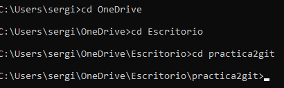

### Elimina la linea - Mac del ficher contenido.txt

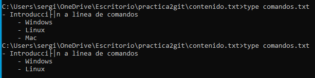

### Comprueba el estado del repositorio

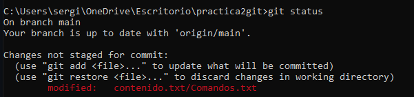

### Deshaz los cambios realizados en el fichero contenido.txt y vuelve a la versión anterkior del fichero.

### Comprobar el estado del repositorio   

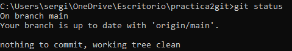

###  Contenido del fichero modificado.

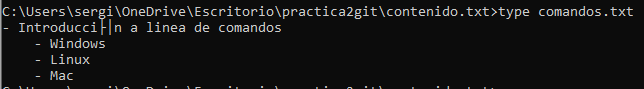

### Eliminar la última línea del fichero contenido.txt y guardarlo.

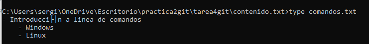

### Añadir los cambios a la zona de preparado.

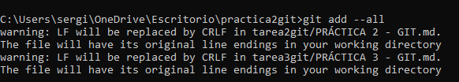

### Comprobar de nuevo el estado del repositorio.

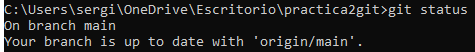

### Quitar los cambios de la zona de intercambio temporal, pero mantenerlos en el directorio de trabajo.

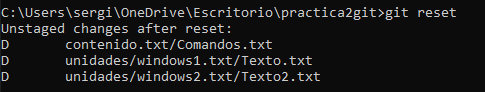

### Comprobar de nuevo el estado del repositorio.

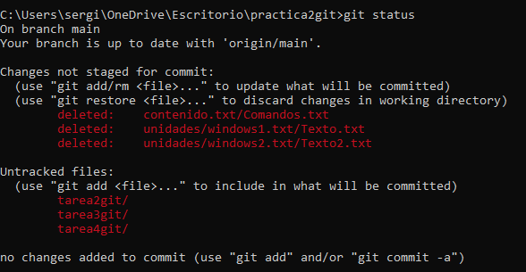

### Deshacer los cambios realizados en el fichero contenido.txt para volver a la versión anterior del fichero.

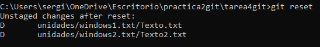

### Volver a comprobar el estado del repositorio. FIN

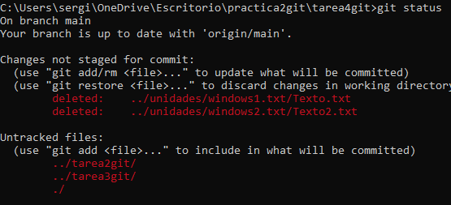
